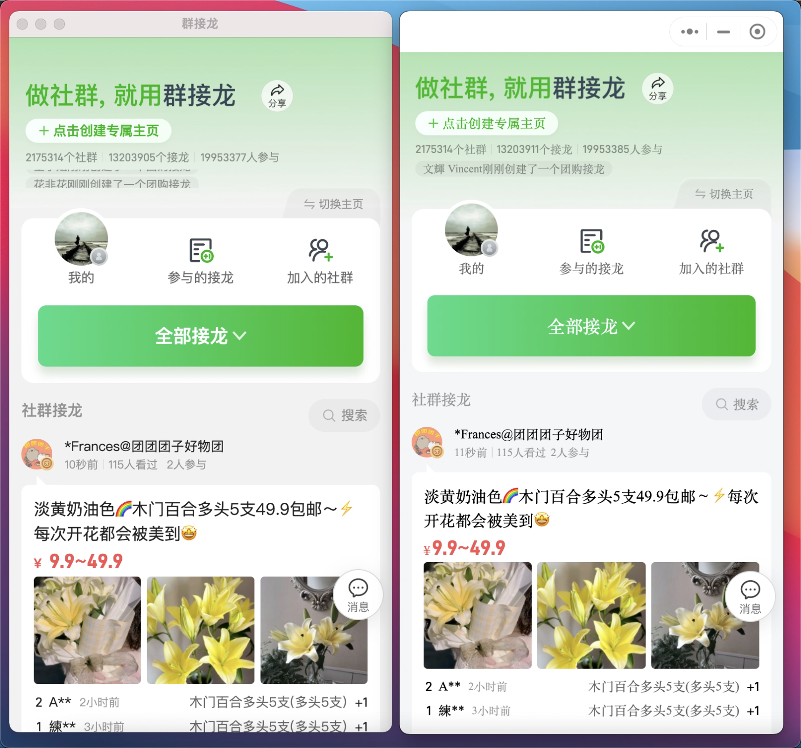
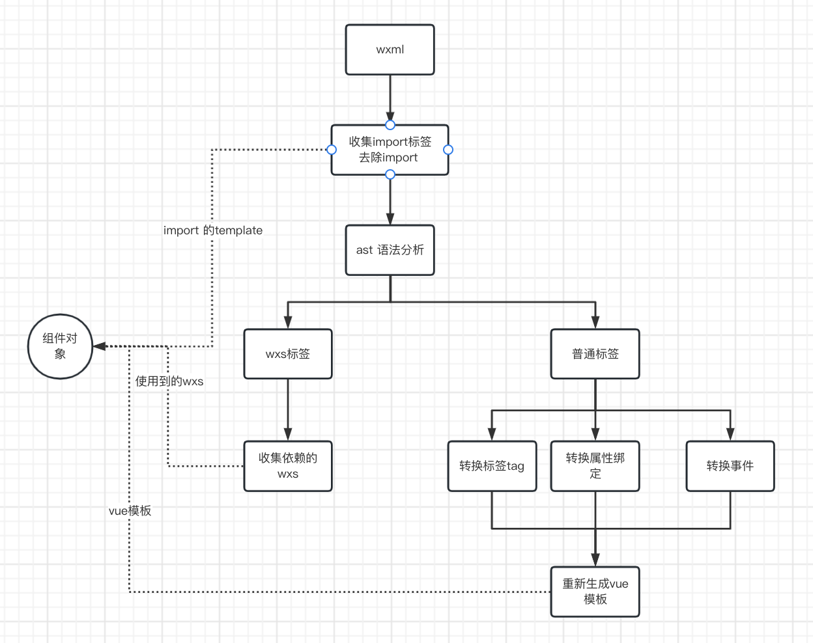
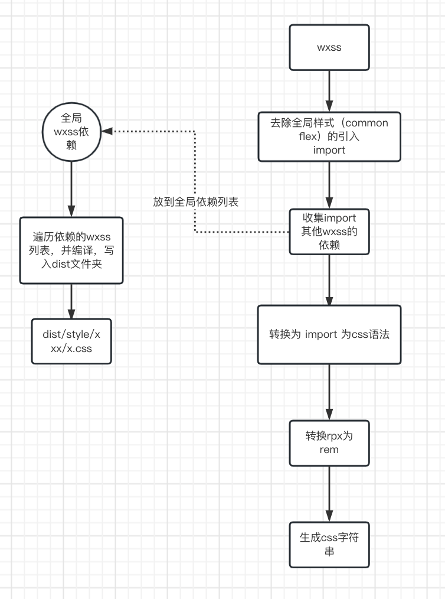
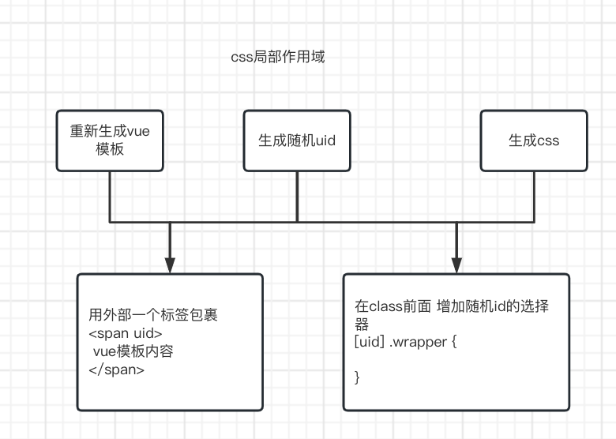

# wxml2vue
将小程序项目转为h5项目，可以再h5端访问，减少相同逻辑的开发。

## 使用场景
内部系统想使用小程序的相关功能，目前有两个方案：
1. 打开一个小程序的桌面应用，然后在小程序中多次操作，然后去到对应的页面。（操作耗时）
2. 在内部系统中开发一个和小程序一模一样的功能。（开发耗时）

使用小程序转h5项目之后，可以直接通过iframe 打开小程序的页面，直达功能页面，减少操作耗时。

## 转换效果
使用electron 构建了一个webview 访问h5，对比小程序的效果如下：
[](./doc_img/result.mp4)

## 快速开始

### 先构建当前项目
```
npm run build
```
后续如果只有ts的修改 可以只编译ts
```
npm run build:ts
```

### 然后就到小程序项目下使用，目前仅仅支持dist文件夹下
``` app.json
{
    "change2h5Page": [
        "pages/index/index"
    ],
    ...其他配置
}
```

```
# qjl-plus需要先 npm run restart 构建出dist 文件夹
cd 文件目录/qjl-plus/packages/mini/dist
# dist文件夹下的app.json  需要增加 change2h5Page
node 自己目录/wxml2vue/src/compiler/run 自己目录/qjl-plus/packages/mini/dist/
http-server -p 8081 ./
```

### 访问被编译出来的页面
```
http://192.168.120.70:8081/miniapp.html?token=小程序token&h5token=suibian&authorization=1&plus_uid=5471761&hideWrapper=true
```


## 原理

### 小程序和webview的关系
小程序底层也是通过webview渲染的，通过仔细观察，会发现小程序的wxml语法，生命周期，其实和vue 是有点类似的。
底层都是通过虚拟dom来构建渲染树，然后渲染。

基于这个前提，我们将小程序编译成h5，并成功渲染出页面。

### 小程序一个页面或组件的组成
页面可以当场一个组件来处理，只是生命周期的钩子不一样。
xxx.js：  组件的生命周期逻辑，在什么时间点，触发怎样的逻辑。
xxx.json：使用了什么组件，以及对应的组件别名，组件路径是什么
xxx.wxml: 本质上就是一个html + 逻辑渲染语句，只不过需要特定的语法进行解析
xxx.wxss: 本质上就是css 可以当场css处理

看着好像很简单，但是真正去转换的时候 会发现有不少的问题需要处理。

比如：
1. css样式隔离，我们都知道，小程序的组件样式 只作用与当前组件，不影响其他组件。
2. rpx 在移动端的适配
3. wxml 的template标签实现 （无状态组件）
4. wxml 的import 标签实现 （导入文件）
5. wxml tap事件的兼容
6. 小程序底层组件的实现（使用了kbone-ui 组件库）
7. 适配小程序特有的 wxs 的逻辑，将wxs 引入到页面data对象中
8. 

## 代码目录
主要编译逻辑
> src/compiler/index.ts

编译参数 第一个参数为小程序项目路径
```
node xxxx/wxml2vue/src/compiler/run xxxxx/xxx/xxx/dist
```
编译逻辑
```
const main = () => {
  let p = process.argv[2]
  if (!path.isAbsolute(p)) {
    p = path.resolve(path.join(process.cwd(), p))
  }
  cwd = p
  // 编译小程序页面 将小程序页面编译成js
  compile(p)
  console.log("compile success")
  // 支持自定义属性的特定class
  outputDIYComponentsHasClassAttr(handleDIYComponentsHasClassAttr)
  // 构建bundle
  makeBundle(p)
}
```
compile代码：
```
/**
 * 编译需要转换的小程序页面
 * @param p 
 */
const compile = (p: string): void => {
  // 读取app.json
  const appJson = require(path.join(p, "app.json"))
  // 构建一个小程序的对象
  const miniApp = new MiniAppInfo()
  // 设置根路径
  miniApp.root = p
  // 解析app.json 根据app.json找到需要编译的页面，根据页面找到依赖的组件，并编译
  miniApp.parseByAppJson(appJson)
  // 生成小程序运行js
  genMiniJS(miniApp)     
  // 生成小程序渲染页面 miniapp.html 
  // 这个页面引入了vue 引入了小程序运行逻辑
  genHtml()
  // 将依赖到的wxss 也进行编译
  loadDependenceWxss();
  // 复制vue的运行库
  copyVueMinJS()
  // 复制websdk文件
  copyWebSdkJS()
  // 复制vue的事件转换
  copyVue2TouchEventsJS()
  // 复制vant依赖库
  copyVant()
  // 复制移动端的适配方案 设置适合的rem
  copyFlexibleJS()
  // 复制weui的css 兼容一些基础样式
  copyWeuiCss()
}
```
## 核心编译逻辑
对于wxml 和 wxss 都是需要进行一遍转化的，转化为vue能认识的模板，以及浏览器能认识的css。

### 核心编译页面wxml逻辑
定位代码：
> convertWxmlToVueTemplate
将wxml 解析成ast 语法树， 找出wxs 标签，并设置依赖wxs，转换wxml 语法表达式，事件变成vue能支持的。
最后获取到 import 的标签列表，wxs 依赖列表，vue模板的html
流程图如下:


### wxml 内表达式的处理逻辑
在wxml 里面是支持取未声明的变量的值的，如果是未声明的值，默认是undefined。
我原本的处理方法，只是通过嵌套一个data的作用域，然后运行表达式，但是遇到未声明的变量就会有问题。
比如：
```html
<view wx:if="{{!product.info.isShow}}"></view>
```

```js
// js 运行时
with(this.data){
  try{
    return !product.info.isShow
  }catch(e){
    return undefined
  }
}
```
但是这样子会有两个问题：
1. 一开始 data 没有product 导致报错 product not defined 整个返回值为 undefined 实际上整个表达式的值 应该是true 在小程序里 product 没声明,会当成undefined处理。
2. 如果product 在data里，但是 product.info 是undefined 也会报错 不能从undefined里面取值 isShow，整个返回值为undefined

解决方案：
1. 将js表达式里面的字面量都改为函数取值.
比如： product.info.isShow => _sz(data, "product", "info", "isShow")
又比如 product[tag].isShow => _sz(data, "product", _sz(data, "tag"), "isShow")
product => _sz(data, "product")
_sz 函数里面的话 取到第一个undefined 就直接返回。

### 核心编译css 并设置局部作用域
定位代码
>convertWxssToCss

#### 转换css
转换css 主要处理两个：
1. 收集依赖到的其他wxss，并且转换写法为：``` @import url('../style/s2.css');```
2. 转换rpx 为 rem, 只需要将rpx的数字，除 100，保留两位小数即可（具体还需要结合flexible去调节这个转换逻辑，不过小程序基本都是这个，只要设计稿宽度是750）。

转换wxss为css流程图如下：


#### 设置css局部作用域
css局部作用域的话，主要是利用了css的属性选择器，只有在上层节点有特定属性，其他选择器匹配上才生效。
如下实例的 [xduhd] .wrapper 只有在标签 <span xduhd> 内才会生效
```html
<span xduhd>
    <div class="wrapper">
        <div></div>
    </div>
</span>

```

```css
[xduhd] .wrapper {
    height: 500px;
    width: 900px
}
```

设置css局部作用域流程图


上面这种方式具备一定的局部css 作用，但是也会影响到子孙后代的css样式。
比如：
```html
<span xduhd>
    <div class="wrapper">
        <div></div>
        <span xsdrsd>
          <div class="wrapper">
          </div>
        <span>
    </div>
</span>
```
```css
[xduhd] .wrapper {
  // 这里的样式 也会匹配到子组件，导致异常
  position: absolute
}
```

解决方案：
使用两个class 相连 ,编译wxml的时候 将页面上节点使用到class的 都加上 id 
```html
<span >
    <div class="xduhd wrapper">
        <div></div>
        <span xsdrsd>
          <div class="xsdrsd wrapper">
          </div>
        <span>
    </div>
</span>
```
```css
.xduhd.wrapper {
  // 这里的样式 不会匹配到子组件
  position: absolute
}
```

## 核心js运行逻辑
对于组件的js 代码，我们直接运行就好，无需其他编译转换，但是需要增加运行环境的配置
>模拟微信小程序底层逻辑都在/src/runtime内

先整理一下wx 小程序环境内全局的变量，函数有什么
```
App
Page
Component
getApp
getCurrentPages
wx
```

### App
模拟App 方法实现
这里只是注册app， 拿到注册对象，保存起来即可。
```
const App = (options) => {
  if (!options) { 
    app = {}
    return
  }
  app = options
}
```
### Page
模拟注册页面逻辑
```
Page = function(pageConfig){
    // currentName 是页面路径
    // 这里主要是 结合 vue模板 wxs 使用的组件列表 使用的template列表 做个映射
    registerPage(currentName, currentTemplate, page, currentWxs, currentUsingComponents, currentImportTemplates)
}
const registerPage = (name, template, page, wxs, components, importTemplates) => {
  // console.log("Register page ->", name)
  // 做个映射 将页面路径以及对应配置存起来 等需要渲染再处理
  pages.set(name, {
    template, page, wxs, components, importTemplates
  })
}
```

### 路由跳转
路由切换，这里有两个方案：
1. 是使用vue-router， 通过vue-route 前进，后退，替换，有动画，简单。
2. 自己做路由切换，比较有挑战性，也可以理解一下vue router 是怎么做到的。

这里我使用了第二个方案。
#### 跳转页面到 wx.navigateTo 

1. 先将当前展示的节点 id="app" id属性改为 id-app1 设置属性隐藏，并触发当前页面的onhide方法，记录当前滚动高度
```html
<div id="app-1" style=" display: none"></div>
```
2. 然后创建页面挂在节点
```html
<div id="app"></div>
```
3. 然后将页面的渲染模板 设置到 标签里面，然后构建一个Vue对象 
上诉步骤即可完成页面的跳转。

#### 页面返回 wx.navigateBack
1. 首先 拿到当前渲染的页面节点
2. 触发vue节点的destory 
3. 拿到vue节点对应的 dom节点 删除
4. 拿到上一个节点，将隐藏样式去除
5. 拿到上一个节点的滚动高度，滚动到上次的高度。

#### 页面替换 wx.redirectTo
1. 拿到当前的页面节点
2. 销毁当前的页面vue节点，以及dom节点
3. 调用history.replaceState 替换当前历史栈的数据。

#### 监听页面的后退操作
因为页面是可以通过手势返回的，所以必须监听页面级别的路由变化 window.onpopstate 
事件触发 就运行一下 wx.navigateBack


## 待处理问题列表
1. wx.createSelectorQuery 在onload调用 找不到节点的问题
   暂时解决 在onload之后调用 有待优化
2. ~~page 对象上 有和data 同名的方法 比如: page.showModel 是一个function 还在页面上用到了 wx:if="showModel"  bind:tap="showModel" 会有问题，小程序是双线程的 所以没问题 
   暂时解决 不使用同名的属性名~~
   已解决 将页面渲染数据隔离开，都放到this.data,渲染数据不设置this
3. 选择图片，视频，文件api
4. kbone的 wx-input 组件 在外部属性没修改的状态下，内部的值会有变化。
5. 页面跳转没有动画效果, 并且不像卡片的切换效果
6. 页面跳转之间传值可能存在一定问题
   